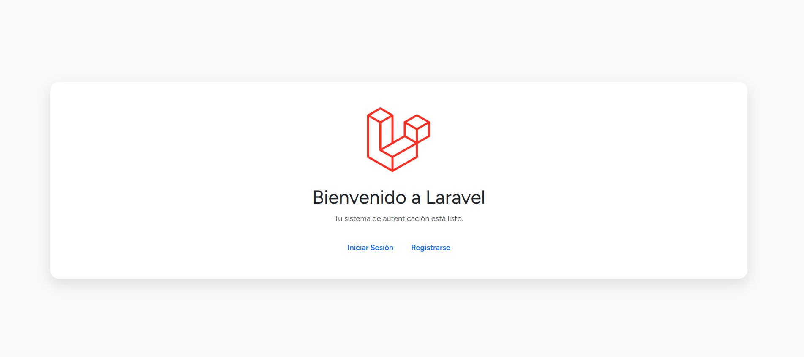
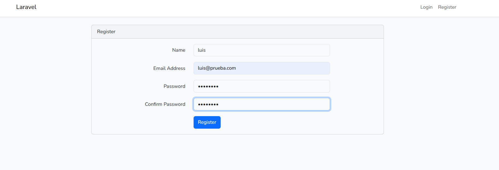
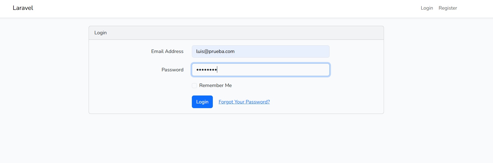
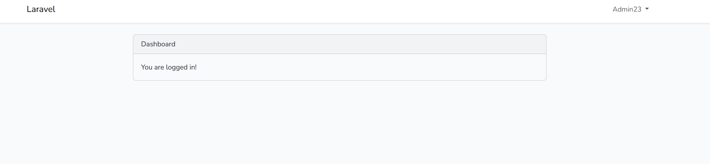
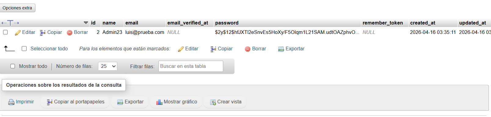

# Laboratorio #2 - Implementación de Login en Laravel

## 1. Introducción
En este proyecto veremos la implementación de un sistema de autenticación (Login y Registro) utilizando el framework Laravel 11. Se explora la arquitectura Modelo-Vista-Controlador (MVC), la gestión de dependencias con Composer, el manejo de front-end con Vite y la interacción con bases de datos mediante WampServer.

## 2. Requisitos Previos
Para la ejecución de este laboratorio se configuró el siguiente entorno:
- **Sistema Operativo:** Windows 11
- **Servidor Local:** WampServer (Apache 2.4.65, MySQL 8.4.7)
- **Lenguaje:** PHP 8.3.28
- **Gestor de Dependencias:** Composer 2.9.5
- **Editor de Código:** Visual Studio Code

## 3. Instalación Implementada
1. **Creación del proyecto:** `laravel new primer-proyecto`
2. **Instalación de Laravel UI:** `composer require laravel/ui`
3. **Configuración de autenticación:** `php artisan ui bootstrap --auth`
4. **Compilación de assets:** `npm install` y `npm run dev`
5. **Ejecución de migraciones:** `php artisan migrate`

## 4. Dificultades y Soluciones
- **Dificultad:** Visualización desordenada y estilos rotos en la página de bienvenida por conflicto entre Tailwind y Bootstrap al instalar Laravel UI.
- **Solución:** Se realizó una limpieza del código en `welcome.blade.php` eliminando estilos residuales y se configuró la vinculación de recursos mediante la directiva `@vite(['resources/sass/app.scss', 'resources/js/app.js'])` para asegurar la carga correcta de Bootstrap.

## 5. Resultados Obtenidos (Evidencias)
Aquí se muestra el funcionamiento del flujo MVC en el sistema:

- **Pantalla de Inicio:**

- **Formulario de Registro:**

- **Login:**

- **Dashboard:**

- **Base de Datos (Tabla Users):**

## 6. Referencias de Ayuda
- [Documentación oficial de Laravel](https://laravel.com/docs/11.x/authentication)

## 7. Desarrollador
- **Nombre:** Luis De León
- **Curso:** Desarrollo de Software VII
- **Profesora:** Irina Fong
- **Fecha:** 15 de abril de 2026
